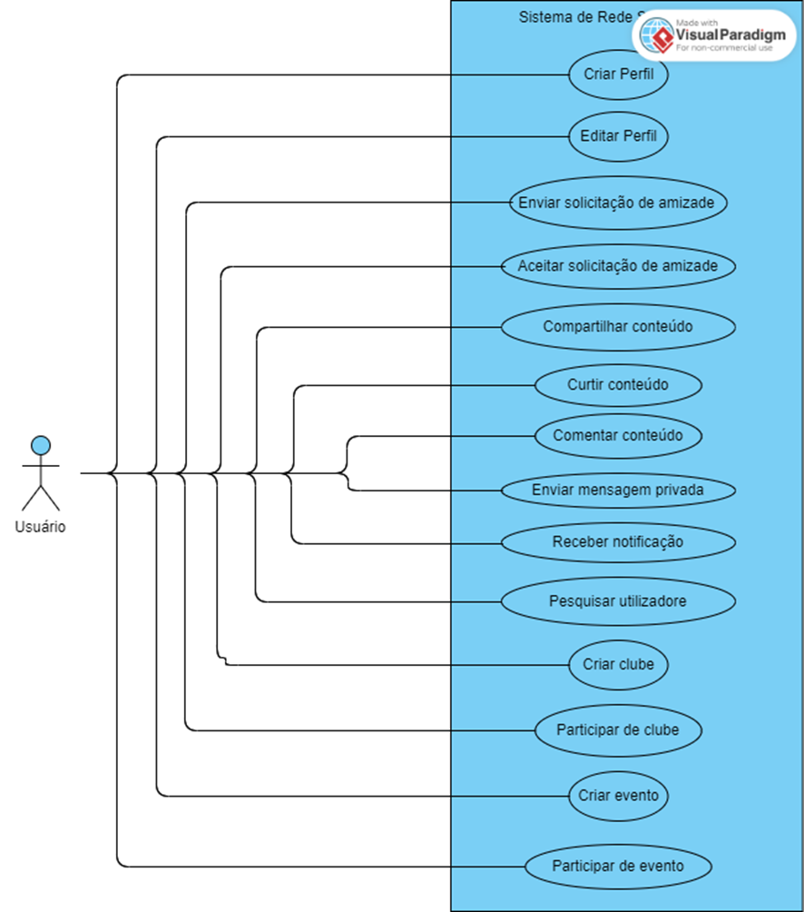
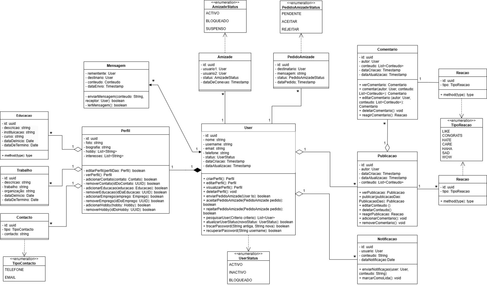

## Sobre Soga

Soga é uma rede social acadêmica com o objectivo de dinamizar a comunicação dentro da universidade e ajudar os estudantes a interagirem uns com os outros e aos clubes na publicação de eventos, atividades e outros.

## Requerimentos

- PHP v8.1
- Composer v2.5.5
- Web Server (HTTPS)

## Inicialização

- `git clone https://github.com/goelnkoko/SOGA`
- `composer install`
- `php artisan serve`
- 

## Funcionalidades

- Criar conta e logar
- Fazer conexões de amizade com outros users
- Publicar conteúdo de texto, imagem e vídeo
- Reagir e comentar publicações
- Perfil de usuário e edição do perfil
- Notificações de novas reações, comentários e publicações

## Diagrama de Caso de Uso

## Diagrama de Classes

## Tecnologias Utlizadas

### Frontend

- HTML
- CSS
- Javascript

### Backend

- PHP 
- Laravel
- Composer
- MySQL
